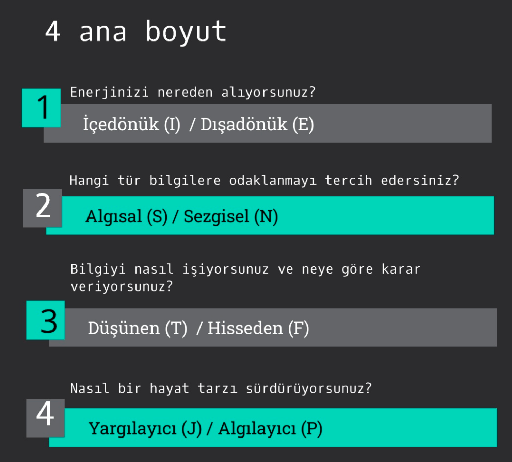
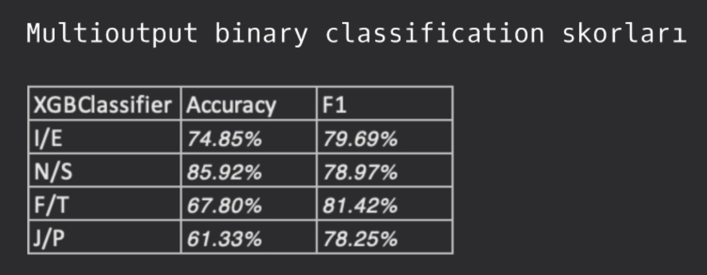

# 👇 CHECK THE APP FROM HERE! 👇

### ✨ https://findmypersonality.streamlit.app ✨

## 1.	Veri seti hikayesi

Veri PersonalityCafe forumu üzerinden toplandı.

Toplamda 8672 satırdan oluşmaktadır. 
Her bir satırda kişi ile ilgili şu bilgileri içermektedir. 

"Type": Bu kişinin önceden label olmuş 4 harfli MBTI tipi
"posts": Kişinin son 50 paylaşımı (Her paylaşım "|||" (3 dikey çizgi karakteri ile ayrılmıştır)

## 2. Değişkenler

Özellik mühendisliğinde CountVectorizer kullanılarak yeni değişkenler üretildi. 

Multioutput binary classification kullanılarak 4 farklı bağımlı değişken üretildi, bu da 4 model geliştirmeme sonuç verdi.

4 farklı bağımlı değişkenlerin her biri 0 ve 1 olarak etiketleniyor. En sonda birleştirilerek sizin MBTI karakter kodunuz belirleniyor.

Son olarak, kullandığım XGBClassifier modellerinin skorlarını aşağıda görebilirsiniz.

 
